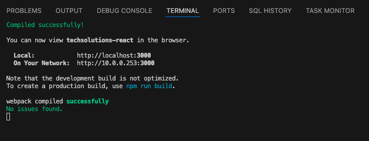

# TechSolutions Pro 🚀

Una plataforma de e-commerce profesional desarrollada con React y TypeScript, especializada en soluciones tecnológicas empresariales. Cuenta con diseño glassmorphism elegante, carrito de compras funcional y sistema de checkout completo.

## 📸 Capturas de Pantalla

### 🏠 Página Principal

*Página de inicio con hero section y estadísticas de la empresa*

### 🛍️ Catálogo de Productos

*Catálogo con filtros por categoría y productos destacados*

### 🛒 Carrito Dropdown

*Dropdown del carrito con diseño glassmorphic*

### 🛒 Página del Carrito

*Página completa del carrito con resumen y métodos de pago*

### 💳 Proceso de Checkout

*Formulario de checkout con validación y pasarela de pago*

### ✅ Confirmación de Compra

*Página de confirmación con detalles del pedido*

### 📞 Página de Contacto

*Formulario de contacto con información empresarial*

### 🦶 Footer Profesional

*Footer con información de contacto y enlaces sociales*

## 🌟 Características Principales

- **Catálogo de Productos**: Sistema de filtrado por categorías con productos destacados
- **Carrito Inteligente**: Dropdown glassmorphic con gestión de productos en tiempo real
- **Checkout Completo**: Proceso de pago con validación de formularios y pasarela de prueba
- **Diseño Responsive**: Glassmorphism con tema verde elegante y efectos visuales modernos
- **Galería de Proyectos**: Portfolio interactivo con modales detallados
- **Sistema de Testimonios**: Reseñas de clientes con calificaciones
- **Página de Contacto**: Formulario funcional con información empresarial

## 🛠️ Tecnologías Utilizadas

### Frontend
- **React 19.1.1** - Framework principal
- **TypeScript** - Tipado estático
- **React Router DOM 7.9.3** - Navegación SPA
- **React Bootstrap 2.10.6** - Componentes UI

### Características Técnicas
- **Context API** - Gestión de estado global del carrito
- **LocalStorage** - Persistencia del carrito
- **Custom Hooks** - Lógica reutilizable
- **Responsive Design** - Compatible con todos los dispositivos
- **Glassmorphism** - Efectos visuales modernos

## 📁 Estructura del Proyecto

```
src/
├── components/           # Componentes reutilizables
│   ├── cards/           # Tarjetas de productos, servicios, testimonios
│   ├── cart/            # Componentes del carrito
│   └── common/          # Header, Footer, Loading
├── contexts/            # Context API (CartContext)
├── data/               # Datos JSON de productos, servicios, testimonios
├── hooks/              # Custom hooks para datos
├── pages/              # Páginas principales de la aplicación
├── services/           # Servicios API
├── styles/             # Estilos adicionales
└── types/              # Tipos TypeScript
```

## 🚀 Instalación y Configuración

### Prerrequisitos
- Node.js (versión 18 o superior)
- npm o yarn

### Pasos de Instalación

1. **Clonar el repositorio**
```bash
git clone https://github.com/RodrigoSanchezDev/techsolutions-react.git
cd techsolutions-react
```

2. **Instalar dependencias**
```bash
npm install
```

3. **Ejecutar en modo desarrollo**
```bash
npm start
```

### 🖥️ Compilación Exitosa

*El proyecto compila correctamente sin errores y está listo para desarrollo*

4. **Compilar para producción**
```bash
npm run build
```

## 🎨 Características de Diseño

### Tema Visual
- **Colores**: Paleta verde profesional con acentos dorados
- **Efectos**: Glassmorphism con blur y transparencias
- **Tipografía**: Fuentes modernas con jerarquía clara
- **Animaciones**: Transiciones suaves y efectos hover

### Responsive Design
- **Mobile First**: Optimizado para dispositivos móviles
- **Breakpoints**: Responsive en tablets y desktop
- **Touch Friendly**: Interfaz táctil optimizada

## 📱 Funcionalidades Principales

### E-commerce
- ✅ Catálogo de productos con filtros
- ✅ Carrito de compras persistente
- ✅ Proceso de checkout completo
- ✅ Página de confirmación de pedido
- ✅ Gestión de cantidades

### Contenido
- ✅ Página de inicio con secciones destacadas
- ✅ Galería de proyectos con modales
- ✅ Servicios profesionales
- ✅ Testimonios de clientes
- ✅ Formulario de contacto

## 🔧 Scripts Disponibles

```bash
npm start          # Servidor de desarrollo
npm run build      # Compilación para producción
npm test          # Ejecutar tests
npm run eject     # Eject de Create React App
```

## 📊 Estructura de Datos

### Productos
```typescript
interface Product {
  id: number;
  nombre: string;
  categoria: string;
  precio: string;
  rating: number;
  imagen: string;
  descripcion: string;
  caracteristicas: string[];
  tecnologias: string[];
  destacado?: boolean;
}
```

### Carrito
```typescript
interface CartItem {
  id: number;
  nombre: string;
  precio: string;
  imagen: string;
  quantity: number;
  type: 'producto' | 'servicio';
}
```

## 🌐 Despliegue

### Opciones de Hosting
- **Netlify**: Deploy automático desde Git
- **Vercel**: Optimizado para React
- **GitHub Pages**: Hosting gratuito
- **AWS S3**: Hosting escalable

### Comandos de Deploy
```bash
# Compilar para producción
npm run build

# Deploy a Netlify (con CLI)
npm install -g netlify-cli
netlify deploy --prod --dir=build
```

## 🔐 Seguridad

- **Validación de formularios** en frontend
- **Sanitización de datos** de entrada
- **Navegación segura** con React Router
- **Gestión de estado** local sin datos sensibles

## 📈 Rendimiento

- **Code Splitting** automático con React
- **Lazy Loading** de componentes
- **Optimización de imágenes** con WebP
- **Minificación** de CSS y JavaScript
- **Caching** de assets estáticos

## 🐛 Solución de Problemas

### Problemas Comunes

**Error de compilación**
```bash
rm -rf node_modules package-lock.json
npm install
```

**Problemas de caché**
```bash
npm start -- --reset-cache
```

## 🤝 Contribución

1. Fork el proyecto
2. Crea una rama para tu feature (`git checkout -b feature/AmazingFeature`)
3. Commit tus cambios (`git commit -m 'Add some AmazingFeature'`)
4. Push a la rama (`git push origin feature/AmazingFeature`)
5. Abre un Pull Request

## 📄 Licencia

Este proyecto está bajo la Licencia MIT. Ver el archivo `LICENSE` para más detalles.

## 👨‍💻 Autor

**Rodrigo Sanchez**
- Website: [sanchezdev.com](https://sanchezdev.com)
- GitHub: [@RodrigoSanchezDev](https://github.com/RodrigoSanchezDev)
- Email: contacto@sanchezdev.com

## 🙏 Agradecimientos

- React team por el framework
- Bootstrap team por los componentes UI
- Unsplash por las imágenes de demostración
- FontAwesome por los iconos

---

⭐ Si este proyecto te fue útil, ¡no olvides darle una estrella en GitHub!
