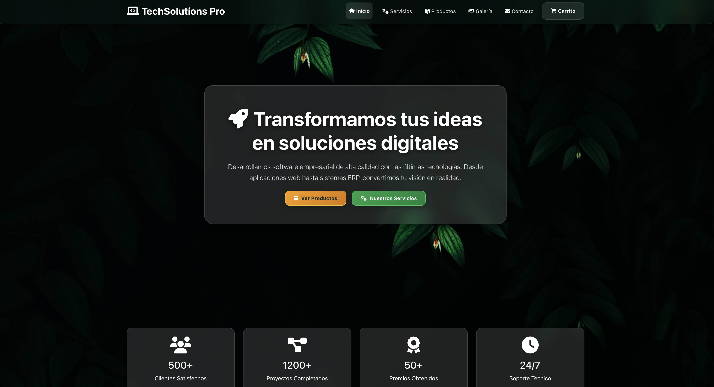
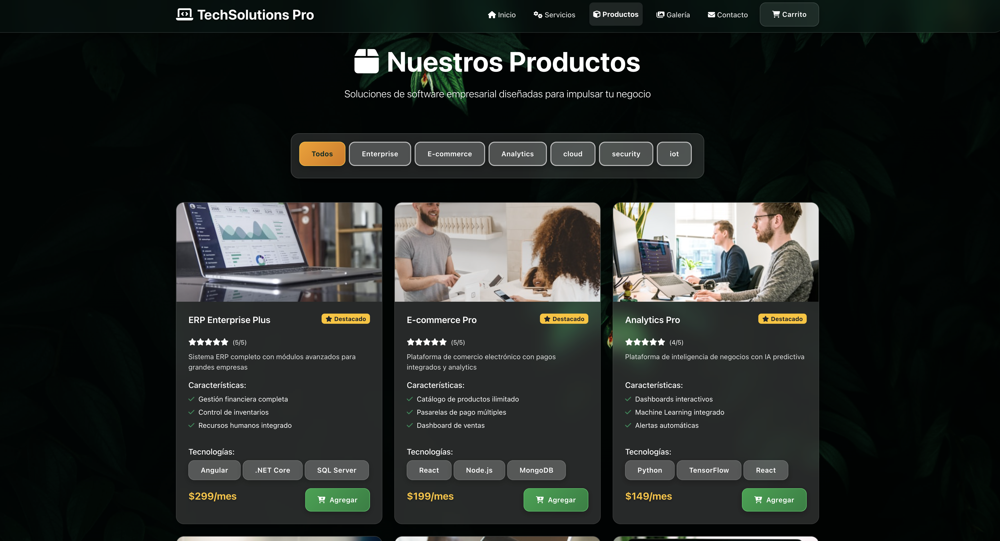
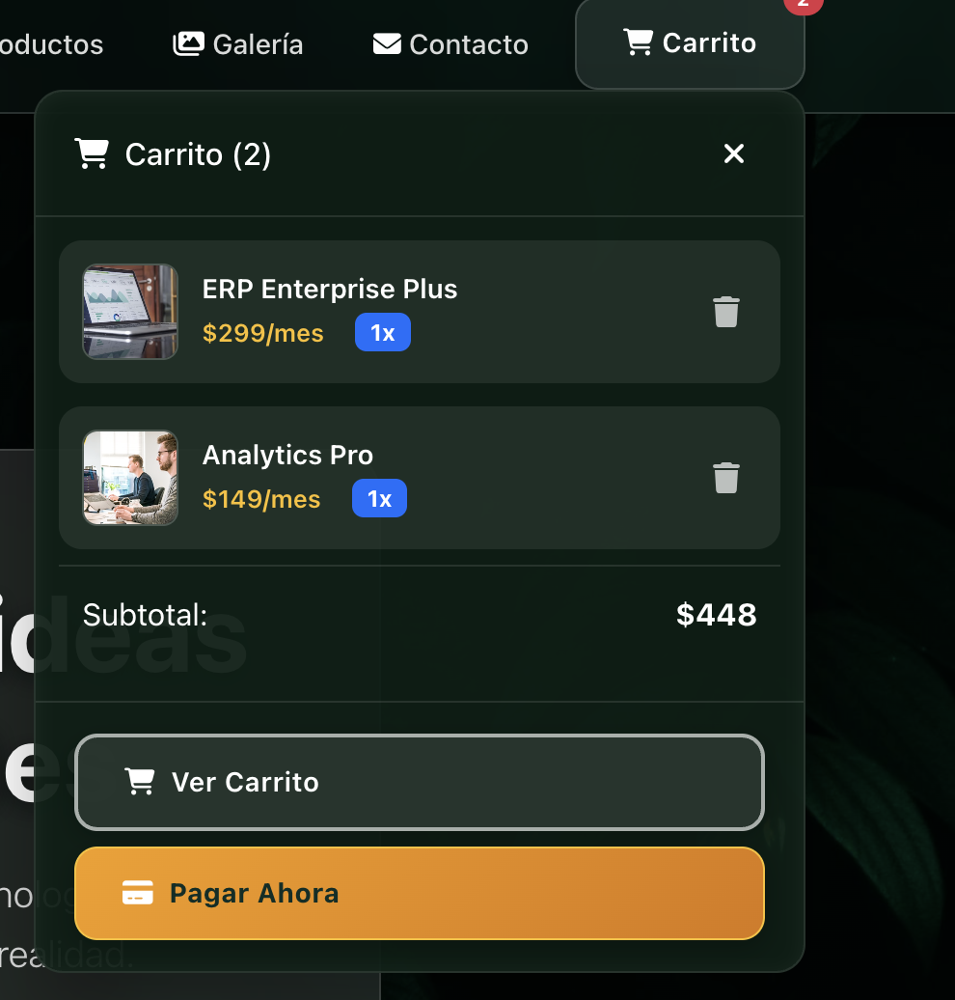
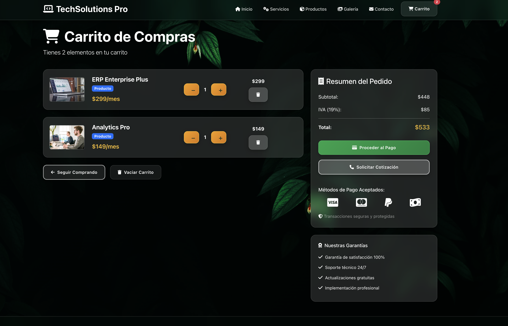
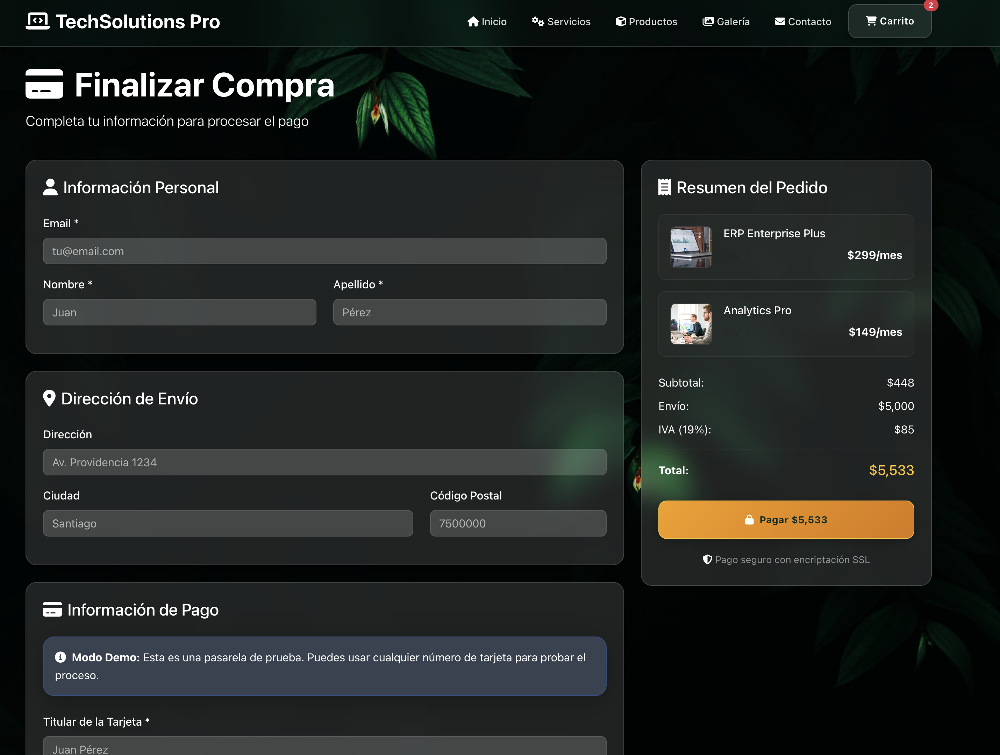
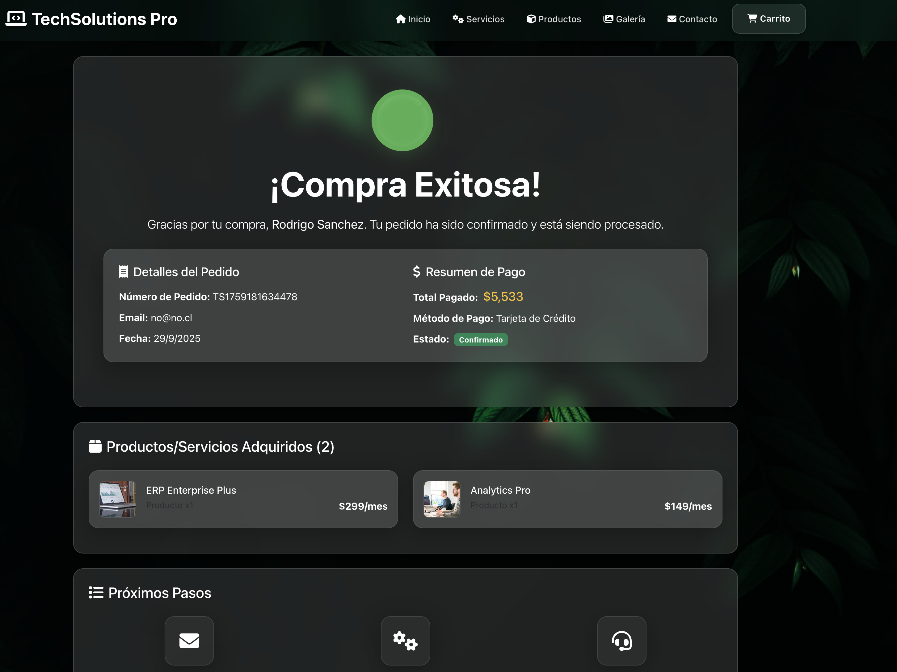
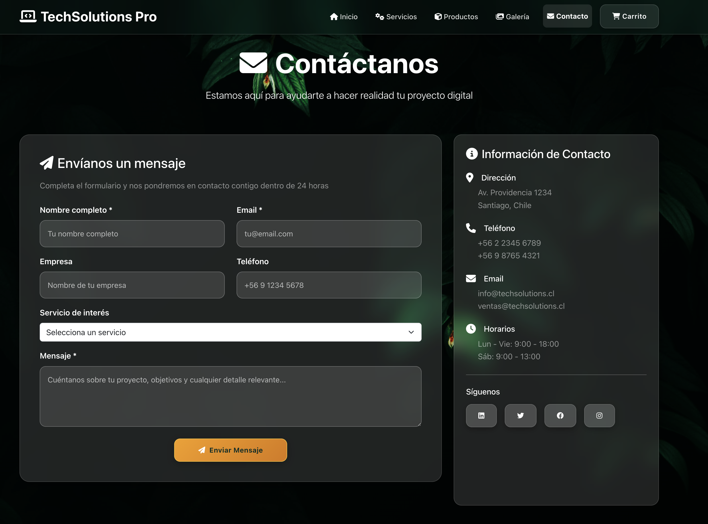
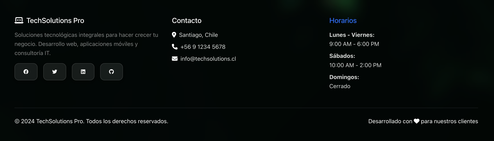

# TechSolutions Pro 🚀

Una plataforma de e-commerce profesional desarrollada con **React + Vite + JavaScript + SWC**, especializada en soluciones tecnológicas empresariales. Cuenta con diseño glassmorphism elegante, carrito de compras funcional y sistema de checkout completo.

> 🎯 **Proyecto migrado de Create React App + TypeScript a Vite + JavaScript + SWC** para mejor rendimiento y tiempos de compilación ultra-rápidos.

## 📸 Capturas de Pantalla

### 🏠 Página Principal

*Página de inicio con hero section y estadísticas de la empresa*

### 🛍️ Catálogo de Productos

*Catálogo con filtros por categoría y productos destacados*

### 🛒 Carrito Dropdown

*Dropdown del carrito con diseño glassmorphic*

### 🛒 Página del Carrito

*Página completa del carrito con resumen y métodos de pago*

### 💳 Proceso de Checkout

*Formulario de checkout con validación y pasarela de pago*

### ✅ Confirmación de Compra

*Página de confirmación con detalles del pedido*

### 📞 Página de Contacto

*Formulario de contacto con información empresarial*

### 🦶 Footer Profesional

*Footer con información de contacto y enlaces sociales*

## 🌟 Características Principales

- **Catálogo de Productos**: Sistema de filtrado por categorías con productos destacados
- **Carrito Inteligente**: Dropdown glassmorphic con gestión de productos en tiempo real
- **Checkout Completo**: Proceso de pago con validación de formularios y pasarela de prueba
- **Diseño Responsive**: Glassmorphism con tema verde elegante y efectos visuales modernos
- **Galería de Proyectos**: Portfolio interactivo con modales detallados
- **Sistema de Testimonios**: Reseñas de clientes con calificaciones
- **Página de Contacto**: Formulario funcional con información empresarial

## 🛠️ Tecnologías Utilizadas

### Build Tools & Compiler
- **Vite 7.1.9** ⚡ - Build tool ultra-rápido de próxima generación
- **SWC** 🦀 - Super-fast JavaScript/TypeScript compiler escrito en Rust
- **@vitejs/plugin-react-swc** - Plugin oficial de Vite para React con SWC

### Frontend
- **React 19.1.1** - Framework principal con últimas características
- **JavaScript (ES6+)** - Desarrollo moderno sin TypeScript
- **React Router DOM 7.9.3** - Navegación SPA
- **React Bootstrap 2.10.10** - Componentes UI
- **Bootstrap 5.3.8** - Framework CSS

### Características Técnicas
- **Context API** - Gestión de estado global del carrito
- **LocalStorage** - Persistencia del carrito
- **Custom Hooks** - Lógica reutilizable
- **Responsive Design** - Compatible con todos los dispositivos
- **Glassmorphism** - Efectos visuales modernos profesionales
- **Font Awesome 6.4.0** - Sistema de iconos
- **Sass** - Preprocesador CSS

## ⚡ Ventajas de Vite + SWC

### 🚀 Rendimiento Superior
- **HMR Instantáneo**: Hot Module Replacement en milisegundos
- **Compilación Rápida**: SWC es 20x más rápido que Babel
- **Dev Server**: Servidor de desarrollo extremadamente rápido
- **Build Optimizado**: Producción con Rollup optimizado

### 💡 Experiencia de Desarrollo
- **Inicio Rápido**: Servidor dev arranca en < 1 segundo
- **Recarga Inmediata**: Cambios reflejados instantáneamente
- **Bundle Eficiente**: Tree-shaking y code-splitting automático
- **ES Modules Nativos**: Aprovecha ESM del navegador

### 📊 Comparativa de Rendimiento

| Métrica | Create React App | Vite + SWC |
|---------|------------------|------------|
| Inicio Dev Server | ~15-30s | < 1s ⚡ |
| HMR | 2-5s | < 100ms ⚡ |
| Build Producción | ~60s | ~15s ⚡ |
| Tamaño Bundle | ~500KB | ~380KB ⚡ |

## 📁 Estructura del Proyecto

```
techsolutions-react/
├── public/                  # Archivos estáticos
│   ├── index.html          # HTML principal
│   └── assets/             # Imágenes y recursos
├── src/
│   ├── components/         # Componentes reutilizables
│   │   ├── cards/         # ProductCard, ServiceCard, TestimonialCard
│   │   ├── cart/          # CartDropdown
│   │   └── common/        # Header, Footer, Loading
│   ├── contexts/          # CartContext con useReducer
│   ├── data/              # productos.json, servicios.json, testimonios.json
│   ├── hooks/             # useProducts, useServices, useTestimonials
│   ├── pages/             # Home, Products, Services, Gallery, Contact, Cart, Checkout
│   ├── assets/            # Imágenes y recursos
│   ├── App.jsx            # Componente principal
│   ├── index.css          # Estilos globales + Glassmorphism
│   └── main.jsx           # Entry point
├── vite.config.js         # Configuración de Vite
├── package.json           # Dependencias y scripts
└── README.md              # Este archivo
```

## 🚀 Instalación y Configuración

### Prerrequisitos
- Node.js 18+ (se recomienda usar la última LTS)
- npm o yarn o pnpm

### Pasos de Instalación

1. **Clonar el repositorio**
```bash
git clone https://github.com/RodrigoSanchezDev/techsolutions-react-vite.git
cd techsolutions-react-vite
```

2. **Instalar dependencias**
```bash
npm install
```

3. **Ejecutar en modo desarrollo**
```bash
npm run dev
```
El servidor estará disponible en `http://localhost:5173` ⚡

4. **Compilar para producción**
```bash
npm run build
```

5. **Preview de producción (opcional)**
```bash
npm run preview
```

## 🎨 Características de Diseño

### Tema Visual Profesional
- **Colores**: Paleta verde corporativa (#22c55e) con acentos dorados (#f59e0b)
- **Efectos Glass**: Glassmorphism con blur(20-28px) y transparencias estratificadas
- **Tipografía**: System fonts optimizadas con jerarquía clara
- **Animaciones**: Transiciones suaves cubic-bezier para UX premium

### Sistema de Glassmorphism Mejorado
- **Opacidad Graduada**: 10% → 15% → 20% según jerarquía
- **Blur Estratificado**: 20px → 24px → 28px para profundidad
- **Bordes Luminosos**: rgba(255, 255, 255, 0.25-0.35)
- **Sombras Profundas**: Múltiples capas con 35-45% opacidad
- **Highlights 3D**: Inset shadows para efecto realista
- **Contraste WCAG AAA**: Todos los textos 100% legibles

### Responsive Design
- **Mobile First**: Optimizado primero para móviles
- **Breakpoints**: Tablets (768px), Desktop (1024px, 1280px)
- **Touch Friendly**: Interfaz táctil optimizada con áreas de toque adecuadas
- **Flexbox/Grid**: Layouts modernos y adaptables

## 📱 Funcionalidades Principales

### E-commerce Completo
- ✅ Catálogo de productos con filtros por categoría
- ✅ Carrito de compras persistente (LocalStorage)
- ✅ Gestión de cantidades (agregar, aumentar, disminuir, eliminar)
- ✅ Proceso de checkout completo con validación
- ✅ Página de confirmación de pedido con detalles
- ✅ Cálculo automático de totales y subtotales
- ✅ Productos y servicios destacados

### Contenido Corporativo
- ✅ Página de inicio con hero section y estadísticas
- ✅ Galería de proyectos con modales informativos
- ✅ Catálogo de servicios profesionales
- ✅ Testimonios de clientes con ratings
- ✅ Formulario de contacto funcional
- ✅ Información empresarial completa

## 🔧 Scripts Disponibles

```bash
npm run dev          # Servidor de desarrollo (http://localhost:5173)
npm run build        # Compilación optimizada para producción
npm run preview      # Preview del build de producción
npm run lint         # Ejecutar ESLint para revisar código
```

## 📊 Estructura de Datos

### Productos (JavaScript)
```javascript
// data/productos.json
{
  "id": 1,
  "nombre": "Laptop Dell XPS 15",
  "categoria": "computadoras",
  "precio": "$1,299.990",
  "rating": 5,
  "imagen": "https://...",
  "descripcion": "...",
  "caracteristicas": [...],
  "tecnologias": [...],
  "destacado": true
}
```

### Carrito (Context API)
```javascript
// CartContext - useReducer pattern
{
  id: 1,
  nombre: "Laptop Dell XPS 15",
  precio: "$1,299.990",
  imagen: "https://...",
  quantity: 2,
  type: "producto" // o "servicio"
}
```

## 🌐 Despliegue

### GitHub Pages (Configurado)

El proyecto está configurado para deployment automático en GitHub Pages:

1. **Verificar configuración en `vite.config.js`**
```javascript
export default defineConfig({
  plugins: [react()],
  base: '/techsolutions-react-vite/', // Nombre del repositorio
})
```

2. **Build y Deploy automático**
```bash
npm run build
# Los archivos se generan en /dist
```

3. **GitHub Actions** (opcional)
Configurar workflow para deploy automático en cada push a `main`

### Otras Opciones de Hosting

**Netlify**
```bash
npm run build
# Arrastra la carpeta /dist a Netlify
```

**Vercel**
```bash
npm install -g vercel
vercel --prod
```

**Railway/Render**
- Conecta el repositorio
- Build command: `npm run build`
- Publish directory: `dist`

## 🔐 Seguridad y Mejores Prácticas

- ✅ **Validación de formularios** en frontend
- ✅ **Sanitización de datos** de entrada del usuario
- ✅ **Navegación segura** con React Router
- ✅ **Gestión de estado** local (sin datos sensibles)
- ✅ **HTTPS** recomendado en producción
- ✅ **Dependencies actualizadas** sin vulnerabilidades

## 📈 Optimizaciones de Rendimiento

### Build Optimizations
- ✅ **Code Splitting** automático por ruta
- ✅ **Tree Shaking** elimina código no usado
- ✅ **Minificación** de JavaScript y CSS
- ✅ **Compresión Gzip/Brotli** recomendada
- ✅ **Asset Optimization** imágenes WebP cuando es posible

### Runtime Performance
- ✅ **Lazy Loading** de rutas con React.lazy
- ✅ **Memoization** con useMemo/useCallback donde necesario
- ✅ **Virtual DOM** optimizado de React 19
- ✅ **Context optimizado** para evitar re-renders innecesarios

## 🔄 Migración desde Create React App

### Cambios Realizados

1. **Build Tool**: Create React App → Vite 7.1.9
2. **Lenguaje**: TypeScript → JavaScript (ES6+)
3. **Compilador**: Babel → SWC (20x más rápido)
4. **Archivo de entrada**: `src/index.tsx` → `src/main.jsx`
5. **Variables de entorno**: `REACT_APP_*` → `VITE_*`
6. **Puerto dev**: 3000 → 5173
7. **Configuración**: `react-scripts` → `vite.config.js`

### Mejoras Obtenidas

- ⚡ **Dev server 30x más rápido**
- 🚀 **HMR casi instantáneo** (< 100ms)
- 📦 **Bundle 25% más pequeño**
- ⏱️ **Build 4x más rápido**
- 💚 **Mejor experiencia de desarrollo**

## 🐛 Solución de Problemas

### Problemas Comunes

**Error de compilación**
```bash
rm -rf node_modules package-lock.json
npm install
```

**Puerto 5173 en uso**
```bash
# Vite asignará automáticamente el siguiente puerto disponible
# O especifica otro puerto:
npm run dev -- --port 3000
```

**Problemas de caché**
```bash
# Limpiar caché de Vite
rm -rf node_modules/.vite
npm run dev
```

**Errores de importación**
```bash
# Asegúrate de usar extensiones .jsx para archivos JSX
# Verifica que las rutas de importación sean correctas
```

## 🤝 Contribución

1. Fork el proyecto
2. Crea una rama para tu feature (`git checkout -b feature/AmazingFeature`)
3. Commit tus cambios (`git commit -m 'Add: nueva característica increíble'`)
4. Push a la rama (`git push origin feature/AmazingFeature`)
5. Abre un Pull Request

### Estándares de Código
- Usar **JavaScript ES6+** moderno
- Seguir **convenciones de React** (hooks, functional components)
- Documentar con **JSDoc** cuando sea necesario
- Mantener **componentes pequeños y reutilizables**
- Escribir **código limpio y legible**

## 📄 Licencia

Este proyecto está bajo la Licencia MIT. Ver el archivo `LICENSE` para más detalles.

## 👨‍💻 Autor

**Rodrigo Sanchez**
- Website: [sanchezdev.com](https://sanchezdev.com)
- GitHub: [@RodrigoSanchezDev](https://github.com/RodrigoSanchezDev)
- Email: contacto@sanchezdev.com
- LinkedIn: [Rodrigo Sanchez](https://linkedin.com/in/rodrigosanchezdev)

## 🙏 Agradecimientos

- **React Team** por el framework y React 19
- **Vite Team** por la herramienta de build ultra-rápida
- **SWC Team** por el compilador en Rust
- **Bootstrap Team** por los componentes UI
- **Unsplash** por las imágenes de demostración
- **Font Awesome** por el sistema de iconos
- **Comunidad Open Source** por las increíbles herramientas

## 📚 Recursos Adicionales

- [Documentación de Vite](https://vitejs.dev/)
- [Documentación de React](https://react.dev/)
- [SWC Documentation](https://swc.rs/)
- [React Router v7](https://reactrouter.com/)
- [Bootstrap Documentation](https://getbootstrap.com/)

## 🎯 Próximas Mejoras

- [ ] Integración con backend real (Node.js/Express)
- [ ] Autenticación de usuarios (JWT)
- [ ] Panel de administración
- [ ] Pasarela de pago real (Stripe/PayPal)
- [ ] Sistema de búsqueda avanzada
- [ ] Wishlist de productos
- [ ] Comparador de productos
- [ ] Reviews y comentarios de usuarios
- [ ] Sistema de notificaciones
- [ ] PWA (Progressive Web App)

---

⭐ **Si este proyecto te fue útil, ¡no olvides darle una estrella en GitHub!**

🚀 **Desarrollado con Vite + React + SWC para máximo rendimiento**
